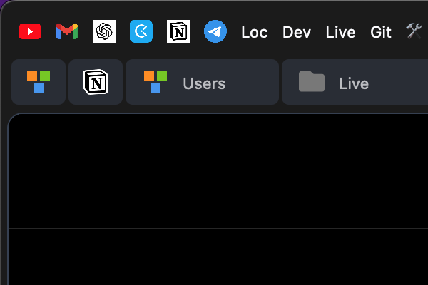

### Horizontal Tabs For Zen

1. It's done with CSS only so it has limitations, one of them is that you can't rearrange tabs. You'll probably find more.
2. It can be broken with any Zen update especially if it involves tabs.
3. If you find any bugs post it under the [issues](https://github.com/Alexcoder5/zen-horizontal-tabs/issues).

### It case you want to thank me: https://www.buymeacoffee.com/alex_coder